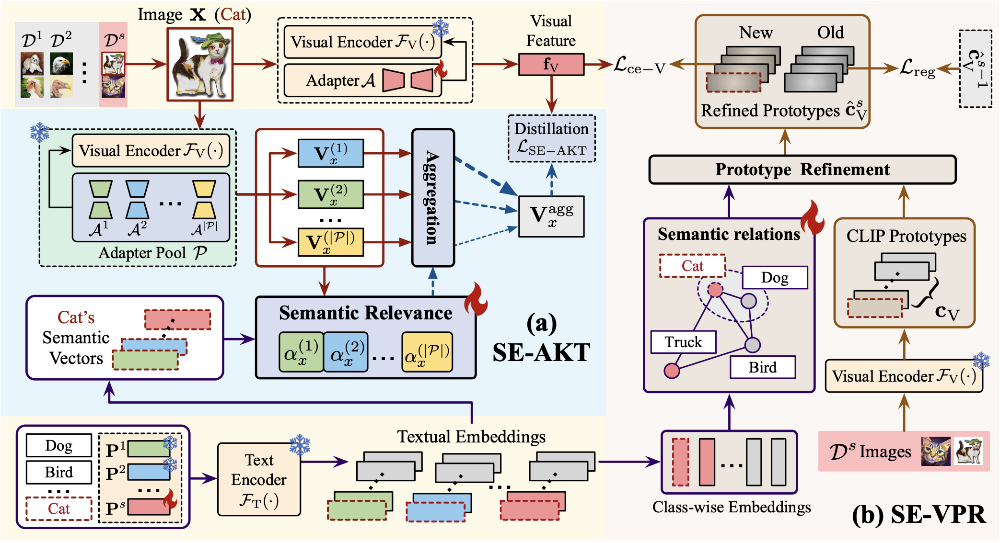

# Harnessing Textual Semantic Priors for Knowledge Transfer and Refinement in CLIP-Driven Continual Learning
Pytorch Code of our paper ``Harnessing Textual Semantic Priors for Knowledge Transfer and Refinement in CLIP-Driven Continual Learning" for Class Incremental Learning (CIL). 

Our paper is accepted by **AAAI 2026**, available at:  
[**Harnessing Textual Semantic Priors for Knowledge Transfer and Refinement in CLIP-Driven Continual Learning**](https://arxiv.org/pdf/2504.19244)

<p align="center">
  
</p>

## Environment
create enviroment using Miniconda (or Anaconda)
```
conda create -n seca python=3.11
conda activate seca
```
install dependencies:
```
pip3 install -r requirements.txt
```

### datasets
Cifar100 will download automatically.

For the remaining benchmarks, we follow the dataset settings of SSIAT and use the processed subsets released by RevisitingCIL: ImageNet-R, ImageNet-A.
Link: [SSIAT](https://github.com/HAIV-Lab/SSIAT)

## Citation
If you find our repo useful for your research, please consider citing our paper:

```bibtex
@inproceedings{he2026harnessing,
  title     = {Harnessing Textual Semantic Priors for Knowledge Transfer and Refinement in CLIP-Driven Continual Learning},
  author    = {He, Lingfeng and Cheng, De and Xu, Di and Wang, Huaijie and Wang, Nannan},
  booktitle = {Proceedings of the AAAI Conference on Artificial Intelligence},
  year      = {2026}
}
```

*All datasets may have some fluctuation due to random spliting. The results might be better by finetuning the hyper-parameters. 
